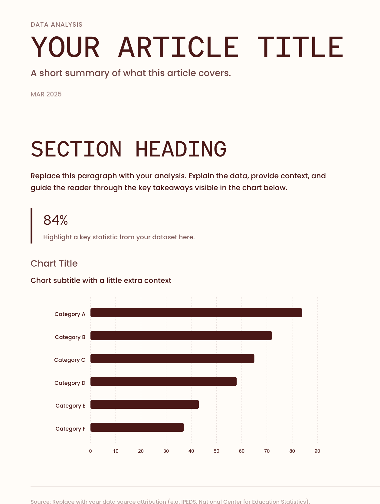
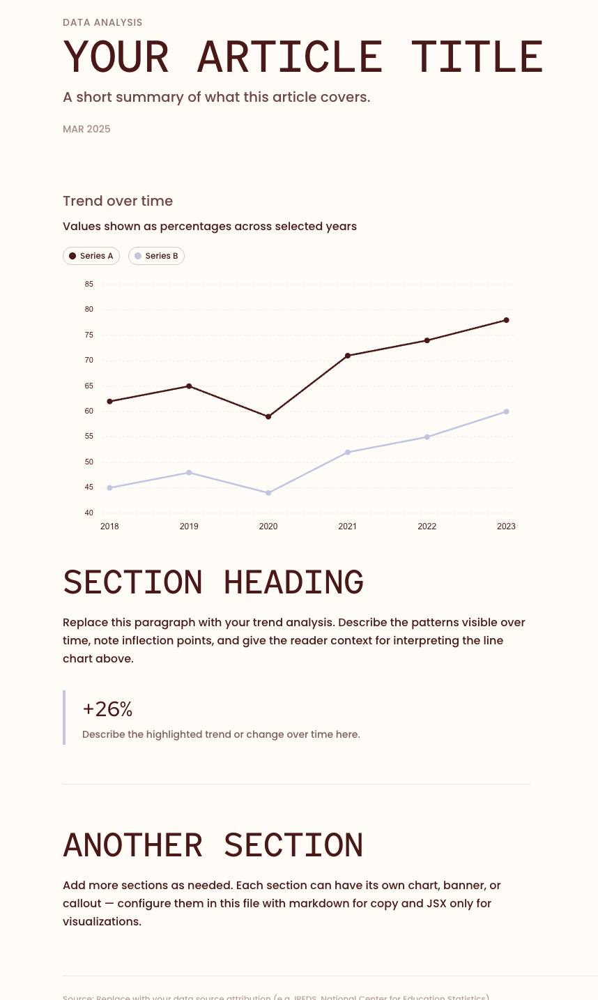
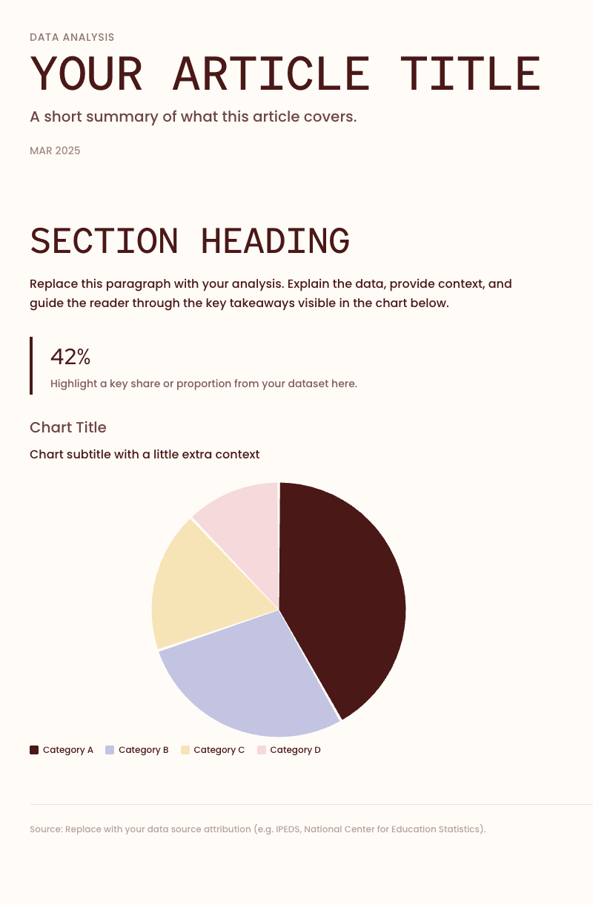
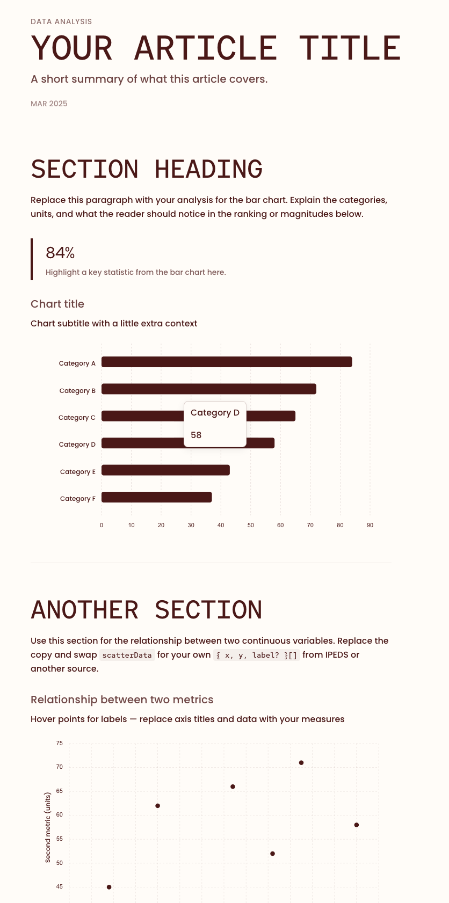
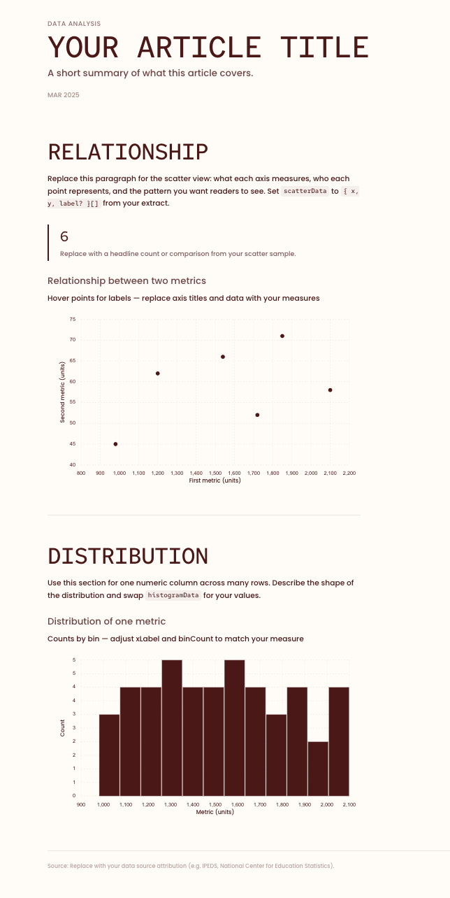

# Template gallery

<table width="100%">
  <tr>
    <td width="33%" valign="top">
      
<strong>simple-bar-chart</strong>

      
    </td>
    <td width="33%" valign="top">
      
<strong>simple-line-chart</strong>

      
    </td>
    <td width="33%" valign="top">
      
<strong>simple-pie-chart</strong>

      
    </td>
  </tr>
  <tr>
    <td width="33%" valign="top">
      
<strong>bar-and-scatter-chart</strong>

      
    </td>
    <td width="33%" valign="top">
      
<strong>scatterplot-and-histogram</strong>

      
    </td>
    <td width="33%" valign="top"></td>
  </tr>
</table>
